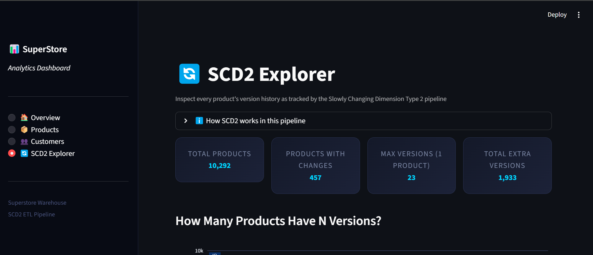

# SuperStore ETL Pipeline

Batch ETL that reads **SuperStoreOrders.csv**, builds a star schema with a
Slowly Changing Dimension Type 2 (SCD2) product table, and loads everything
into a PostgreSQL data warehouse.

## Dashboard Preview


---

## Quick Start

```bash
# 1. Install dependencies
pip install -r requirements.txt

# 2. Create the target database (psql or pgAdmin)
createdb -U postgres superstore_warehouse

# 3. Run the pipeline
python etl.py
```

The pipeline is **idempotent** — running it multiple times produces the same
result because every run truncates and reloads all tables inside a transaction.

---

## Schema

```
dim_date ◄──────────────────── fact_orders ────────────────► dim_customer
                                     │
                                     ▼
                              dim_product_scd2
```

### dim_date
| Column | Type | Description |
|---|---|---|
| date_key | INTEGER PK | YYYYMMDD integer |
| full_date | DATE | Calendar date |
| day / month / quarter / year | SMALLINT | Calendar parts |
| weekday | SMALLINT | 0 = Monday … 6 = Sunday |
| is_weekend | BOOLEAN | Saturday or Sunday |

### dim_customer
| Column | Type | Description |
|---|---|---|
| customer_key | INTEGER PK | Surrogate key |
| customer_name | TEXT | |
| segment | TEXT | Consumer / Corporate / Home Office |
| state / country / market / region | TEXT | Geography hierarchy |

### dim_product_scd2
| Column | Type | Description |
|---|---|---|
| product_key | INTEGER PK | Surrogate key (version-specific) |
| product_id | TEXT | Natural/source key |
| product_name / category / sub_category | TEXT | Tracked attributes |
| start_date | DATE | First date this version was active |
| end_date | DATE | Last date active; **NULL** while current |
| is_current | BOOLEAN | **TRUE** for the active version |

### fact_orders
| Column | Type | Description |
|---|---|---|
| fact_key | INTEGER PK | Surrogate key |
| order_id | TEXT | Source order identifier |
| date_key | INTEGER FK | Order date → dim_date |
| ship_date_key | INTEGER FK | Ship date → dim_date |
| customer_key | INTEGER FK | → dim_customer |
| product_key | INTEGER FK | → dim_product_scd2 (version-aware) |
| sales / profit / shipping_cost / discount | NUMERIC | Financial metrics |
| quantity | INTEGER | Units ordered |
| ship_mode / order_priority | TEXT | Operational attributes |

---

## SCD Type 2 — How It Works

A Slowly Changing Dimension Type 2 preserves the **full history** of attribute
changes by keeping multiple rows per natural key, each representing a distinct
version.

### Versioning rules

| Condition | end_date | is_current |
|---|---|---|
| Active / current record | NULL | TRUE |
| Expired / historical record | date of last day active | FALSE |

### Example

Suppose product `OFF-AP-10000304` was called *Hoover Microwave, White* until
2013-06-14, then renamed to *Breville Stove, Red*:

| product_key | product_id | product_name | start_date | end_date | is_current |
|---|---|---|---|---|---|
| 42 | OFF-AP-10000304 | Hoover Microwave, White | 2011-03-01 | 2013-06-14 | FALSE |
| 43 | OFF-AP-10000304 | Breville Stove, Red | 2013-06-15 | NULL | TRUE |

### Detecting changes (pipeline logic)

1. Source rows are grouped by `product_id` and sorted by `order_date`.
2. The pipeline walks each group chronologically, tracking the current
   `(product_name, category, sub_category)` tuple.
3. When the tuple changes, the open version is **expired** (`end_date` set to
   the day before the new row's `order_date`, `is_current = FALSE`) and a new
   version is **opened**.
4. The last version in each group is always left open (`end_date = NULL`,
   `is_current = TRUE`).

### Querying with SCD2

**Current state of all products:**
```sql
SELECT * FROM dim_product_scd2 WHERE is_current = TRUE;
```

**Historical fact query (as-of join):**
```sql
SELECT
    o.order_id,
    p.product_name,     -- name at time of order
    p.category,
    o.sales
FROM fact_orders o
JOIN dim_product_scd2 p ON p.product_key = o.product_key;
-- product_key already points to the correct historical version
```

**All versions of a product:**
```sql
SELECT product_name, start_date, end_date, is_current
FROM   dim_product_scd2
WHERE  product_id = 'OFF-AP-10000304'
ORDER  BY start_date;
```

---

## Pipeline Stages

```
extract()               reads CSV, coerces dtypes
    │
    ├─► build_dim_customer()     deduplicates on 6 attributes
    ├─► build_dim_date()         full calendar spine (order + ship dates)
    ├─► build_dim_product_scd2() SCD2 versioning (see above)
    └─► build_fact_orders()      surrogate-key lookups, SCD2 interval join
            │
            └─► load()           TRUNCATE → INSERT (idempotent)
                    │
                    └─► run_quality_checks()
```

### Quality checks

| Check | What it catches |
|---|---|
| No duplicate order line items | `(order_id, product_key)` duplicates in fact |
| SCD2 date validity | Missing start_date, end_date < start_date, wrong is_current flag |
| No orphaned customer_key | FK integrity — dim_customer |
| No orphaned product_key | FK integrity — dim_product_scd2 |
| No orphaned date_key | FK integrity — dim_date |

---

## Dependencies

| Package | Purpose |
|---|---|
| pandas | DataFrame transforms, merge_asof interval join |
| numpy | Numeric coercion |
| sqlalchemy | DB engine, DDL, to_sql loader |
| psycopg2-binary | PostgreSQL driver |
